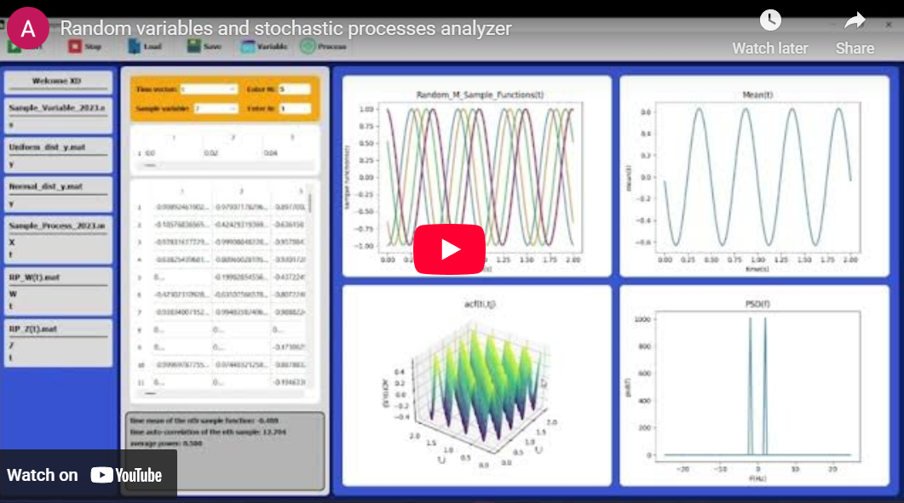
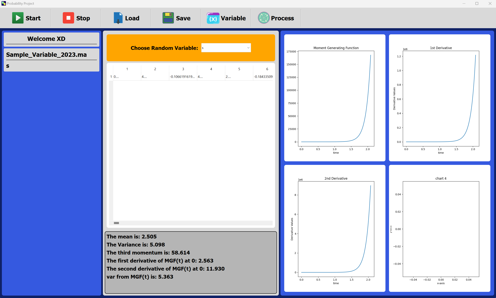
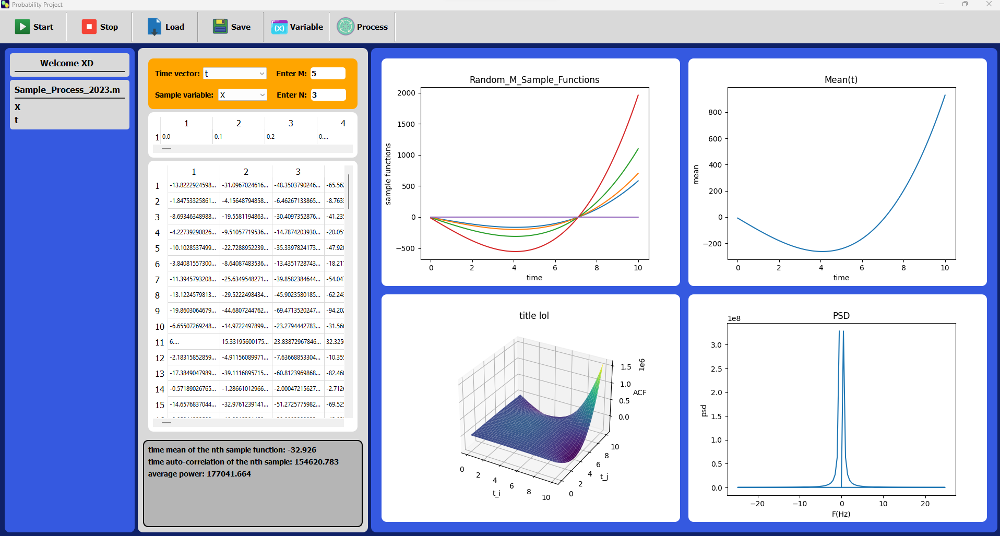
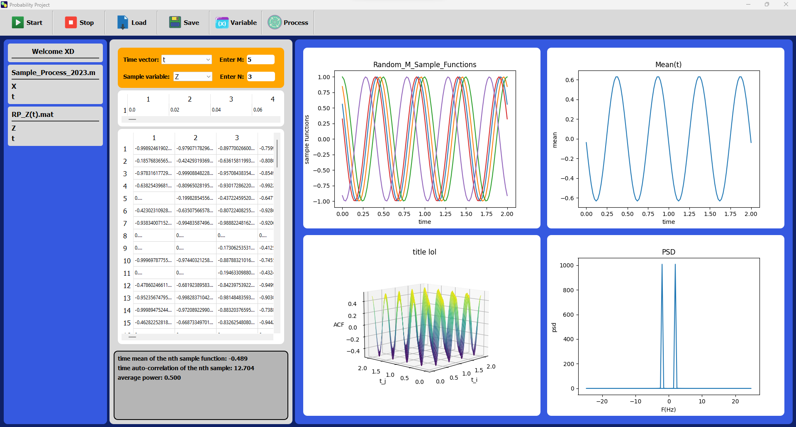
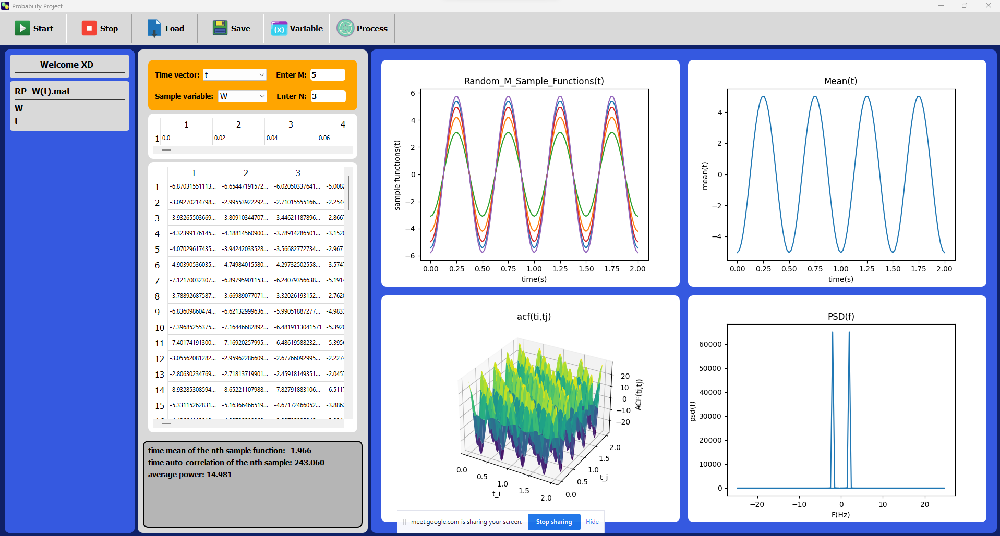

# Probability Analysis GUI 📊🎲

A comprehensive PyQt5-based GUI application for analyzing random variables and stochastic processes. This tool provides statistical analysis, visualization, and computation of various properties including MGF, ACF, PSD, and ensemble statistics.

[](https://www.youtube.com/embed/eVFF6NJ-GZk?si=bvHIgagl-xoWZxYp)

## 📋 Description

This project implements a complete graphical user interface for probability and stochastic processes analysis. The application allows users to load `.mat` files containing random variable data or random process ensembles, and performs comprehensive statistical analysis with real-time visualization.

Built with Python and PyQt5, the tool demonstrates advanced concepts in probability theory including moment generating functions, auto-correlation functions, power spectral density analysis, and ensemble statistics.

<br>
<div align="center">
  <a href="https://codeload.github.com/TendoPain18/random-variables-stochastic-processes-analyzer/legacy.zip/main">
    
  </a>
</div>


## 🎯 Project Objectives

- **Analyze Random Variables**: Calculate mean, variance, third moment, and MGF
- **Process Stochastic Data**: Handle ensemble of sample functions
- **Visualize Statistics**: Real-time plotting of statistical functions
- **Interactive Interface**: User-friendly GUI for data loading and analysis
- **Comprehensive Testing**: Support for various probability distributions

## ✨ Features

### Random Variable Analysis
- **Statistical Moments**: Mean, variance, and third moment calculation
- **MGF Computation**: Moment Generating Function M(t) for 0 < t < 2
- **Derivative Analysis**: First and second derivatives of MGF at t = 0
- **Distribution Support**: Normal, Uniform, and custom distributions
- **Data Visualization**: Real-time plotting of MGF and its derivatives

### Random Process Analysis
- **Sample Function Display**: Plot M random sample functions (user-defined M)
- **Ensemble Statistics**: Calculate and plot ensemble mean
- **Auto-Correlation Function**: 3D visualization of statistical ACF
- **Time Domain Analysis**: Time mean and time ACF for nth sample function
- **Power Spectral Density**: Calculate and plot PSD of the process
- **Average Power**: Compute total average power

### User Interface
- **File Management**: Load `.mat` files with automatic variable detection
- **Dual Mode**: Switch between Random Variable and Random Process modes
- **Interactive Plots**: Four simultaneous plot displays with matplotlib integration
- **Data Preview**: Table view of loaded data
- **Error Handling**: Comprehensive input validation and error messages

## 🔬 Theoretical Background

### Random Variables

**Moment Generating Function (MGF):**
```
M(t) = E[e^(tX)] = (1/N) Σ e^(tx_i)
```

**Statistical Moments:**
- Mean: `E[X] = M'(0)` (first derivative at t=0)
- Variance: `Var(X) = M''(0) - [M'(0)]²` (second derivative at t=0)
- Third Moment: `E[X³] = M'''(0)` (third derivative at t=0)

### Random Processes

**Ensemble Mean:**
```
μ_X(t) = E[X(t)] = lim(N→∞) (1/N) Σ x_i(t)
```

**Statistical Auto-Correlation Function:**
```
R_XX(t_i, t_j) = E[X(t_i)X(t_j)]
```

**Power Spectral Density:**
```
S_XX(f) = |FFT[X(t)]|² / (N · f_s)
```

**Time Mean (for ergodic processes):**
```
<X(t)> = lim(T→∞) (1/T) ∫ x(t) dt
```

## 🎨 GUI Overview

<p align="center">
  
  <br>
  <em>Random Variable Analysis Interface</em>
</p>

<p align="center">
  
  <br>
  <em>Random Process Analysis Interface</em>
</p>

### Interface Components
- **Toolbar**: Start, Stop, Load, Save, Variable/Process mode selection
- **File Panel**: Lists loaded files and their variables
- **Input Panel**:
  - Random Variable: Select variable from dropdown
  - Random Process: Select time vector, sample functions, M value, N value
- **Output Panel**: Displays calculated statistics and results
- **Plot Area**: Four synchronized plots for visualization

## 📊 Test Cases

### Random Variables

**Test Case 1: Sample Variable**
- Load from `Sample_Variable_2023.mat`
- Analyze pre-defined random variable

**Test Case 2: Uniform Distribution**

<p align="center">
  
</p>

- X ~ U(-3, 5)
- Expected Mean: 1.0
- Expected Variance: 5.33

**Test Case 3: Normal Distribution**

<p align="center">
  
</p>

- Y ~ N(-8, 4)
- Expected Mean: -8.0
- Expected Variance: 4.0

### Random Processes

**Test Case 4: Sample Process**
- Load from `Sample_Process_2023.mat`
- Analyze ensemble of sample functions

**Test Case 5: Phase-Randomized Process**

<p align="center">
  
</p>

- Z(t) = cos(4πt + θ), where θ ~ U(0, π)
- Time range: 0 ≤ t ≤ 2
- Analysis: Ensemble mean, ACF, PSD

**Test Case 6: Amplitude-Randomized Process**

<p align="center">
  
</p>

- W(t) = A cos(4πt), where A ~ N(-5, 5)
- Time range: 0 ≤ t ≤ 2
- Comparison: Statistical vs. Time statistics

## 🚀 Getting Started

### Prerequisites

**Python Requirements:**
- Python 3.7+
- PyQt5 5.15.4
- scipy 1.7.2
- numpy 1.21.0
- matplotlib 3.4.3

**MATLAB (Optional):**
- For generating custom `.mat` files
- Provided MATLAB scripts for test case generation

### Installation

1. **Clone the repository**
```bash
git clone https://github.com/yourusername/probability-analysis-gui.git
cd probability-analysis-gui
```

2. **Install dependencies**
```bash
pip install -r requirements.txt
```

3. **Run the application**
```bash
cd probability_project/code
python main.py
```

## 📖 Usage Guide

### Analyzing Random Variables

1. **Launch Application**: Run `main.py`
2. **Select Mode**: Click "Variable" button in toolbar
3. **Load Data**: Click "Load" and select `.mat` file
4. **Choose Variable**: Select from dropdown menu
5. **Start Analysis**: Click "Start" button
6. **View Results**:
   - Plot 1: MGF M(t)
   - Plot 2: First derivative of MGF
   - Plot 3: Second derivative of MGF
   - Output panel shows mean, variance, third moment

### Analyzing Random Processes

1. **Select Mode**: Click "Process" button in toolbar
2. **Load Data**: Load `.mat` file containing time vector and ensemble
3. **Configure**:
   - Select time vector
   - Select sample functions ensemble
   - Enter M (number of sample functions to display)
   - Enter N (sample function index for time statistics)
4. **Start Analysis**: Click "Start" button
5. **View Results**:
   - Plot 1: M random sample functions
   - Plot 2: Ensemble mean
   - Plot 3: 3D ACF surface plot
   - Plot 4: Power spectral density
   - Output panel shows time mean, time ACF, average power

## 🧮 MATLAB Scripts

### Generate Normal Distribution
```matlab
% Create_Normal_Dist.m
num_samples = 1e5;
mean = 0;
variance = 1;
sigma = sqrt(variance);
y = sigma * randn(1, num_samples) + mean;
save('Normal_dist_y.mat', 'y');
```

### Generate Random Process
```matlab
% Create_RP_With_Theta_Follow_Uniform.m
num_samples = 1e2;
t = linspace(0, 2, 101);
theta = pi * rand(1, num_samples);
Z = cos(4 * pi * t + theta');
save('RP_Z(t).mat', 'Z', 't');
```

## 🎓 Learning Outcomes

This project demonstrates:

- **Probability Theory**: MGF, moments, distributions
- **Stochastic Processes**: Ensemble statistics, ergodicity, stationarity
- **Signal Processing**: FFT, PSD, auto-correlation
- **GUI Development**: PyQt5, event handling, multi-threaded operations
- **Data Visualization**: Matplotlib integration, 3D plotting
- **Scientific Computing**: NumPy, SciPy for numerical analysis
- **File I/O**: MATLAB `.mat` file handling

## 📈 Key Results

### Random Variable Analysis

| Distribution | Mean | Variance | Third Moment |
|-------------|------|----------|--------------|
| U(-3, 5)    | 1.0  | 5.33     | 0.0          |
| N(-8, 4)    | -8.0 | 4.0      | -512.0       |

**Observations:**
- MGF always starts at M(0) = 1 ✓
- Mean = M'(0) verified ✓
- Variance = M''(0) - [M'(0)]² verified ✓

### Random Process Analysis

**Ergodicity Test:**
- Z(t): Statistical mean ≠ Time mean → Not Ergodic
- W(t): Statistical mean ≠ Time mean → Not Ergodic

**Stationarity Analysis:**
- Ensemble mean varies with time → Not Stationary
- ACF depends on both t_i and t_j → Not WSS

## 🔧 Technical Details

### Architecture

**Design Pattern**: Model-View-Controller (MVC)
- **Model**: `Calculations.py` - Statistical computations
- **View**: PyQt5 widgets - UI components
- **Controller**: `ProgramWindow.py` - Event handling

**Key Classes:**
- `ProgramWindow`: Main application window
- `Calculations`: Statistical analysis engine
- `RandomVariableWindow`: RV analysis interface
- `RandomProcessWindow`: RP analysis interface
- `PlotsWidget`: Matplotlib integration
- `DataHandler`: File I/O operations

## 🤝 Contributing

Contributions are welcome! Feel free to:

- Add new statistical functions
- Improve visualization options
- Enhance error handling
- Add more probability distributions
- Optimize computation algorithms
- Improve UI/UX design

## 📄 License

This project is licensed under the MIT License - see the LICENSE file for details.

## 🙏 Acknowledgments

- Course: CIE 327 - Probability and Stochastic Processes
- Department: Communications and Information Engineering
- Inspired by probability theory and signal processing fundamentals
- PyQt5 for GUI framework
- Matplotlib for visualization

<br>
<div align="center">
  <a href="YOUR_DOWNLOAD_LINK_HERE">
    
  </a>
</div>

---

<!-- CONTACT -->
<div id="toc" align="center">
  <ul style="list-style: none">
    <summary>
      <h2 align="center"> 🚀 CONTACT ME 🚀 </h2>
    </summary>
  </ul>
</div>

<table align="center" style="width: 100%; max-width: 600px;">
  <tr>
    <td style="width: 20%; text-align: center;">
      <a href="https://www.linkedin.com/in/amr-ashraf-86457134a/" target="_blank">
        
      </a>
    </td>
    <td style="width: 20%; text-align: center;">
      <a href="https://github.com/TendoPain18" target="_blank">
        
      </a>
    </td>
    <td style="width: 20%; text-align: center;">
      <a href="mailto:amrgadalla01@gmail.com">
        
      </a>
    </td>
    <td style="width: 20%; text-align: center;">
      <a href="https://www.facebook.com/amr.ashraf.7311/" target="_blank">
        
      </a>
    </td>
    <td style="width: 20%; text-align: center;">
      <a href="https://wa.me/201019702121" target="_blank">
        
      </a>
    </td>
  </tr>
</table>

<!-- END CONTACT -->

<p align="center">
  <strong>Unlock the power of probability and stochastic analysis! 📊✨</strong>
</p>
